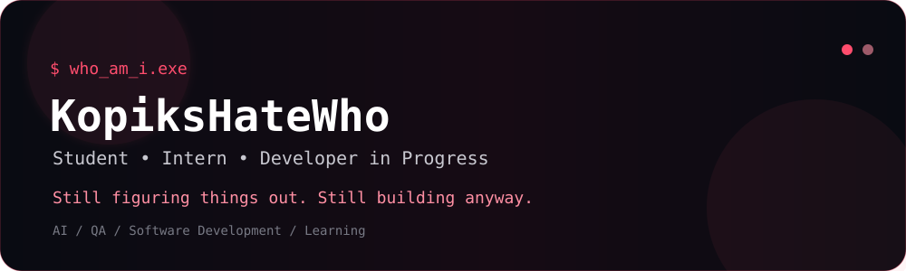
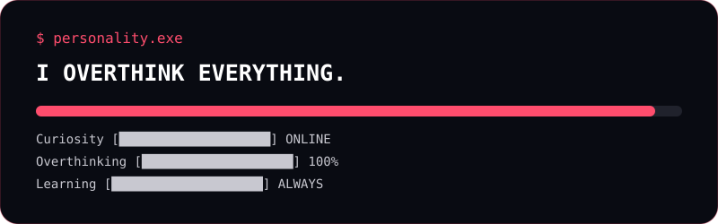
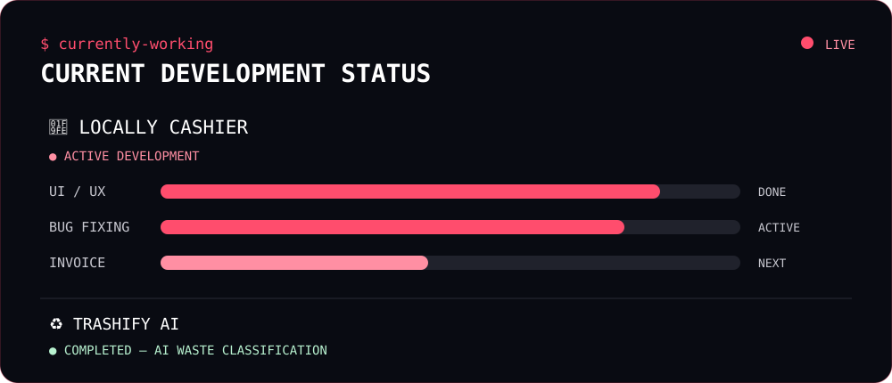
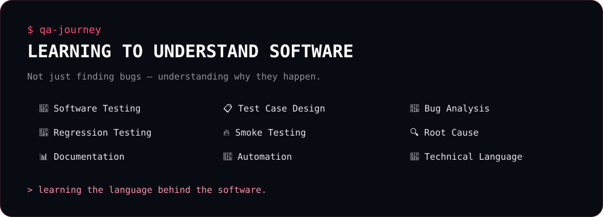
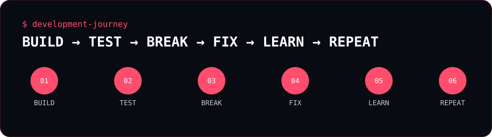
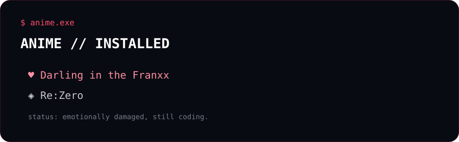
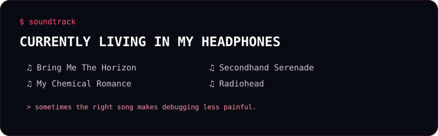

---

👋 About Me

Hey! I'm KopiksHateWho.

I'm a student and intern currently exploring the world of software development, artificial intelligence, and quality assurance.

I'm not trying to define myself as one specific type of developer yet.

I'm still exploring.

Sometimes I'm building applications.

Sometimes I'm training AI models.

Sometimes I'm testing software and trying to understand why something broke.

And sometimes I'm just staring at my code wondering:

«"Why did this work five minutes ago?" 💀»

I'm still figuring out what kind of developer I want to become — and honestly, I'm okay with that.

Every project teaches me something new.

Every bug gives me something new to understand.

Every mistake gives me another opportunity to improve.

"Still figuring things out. Still building anyway."

---

🧑‍💻 Personal Profile

| 
👤 Username| "KopiksHateWho"
🧑 Pronouns| He / Him
🎓 Status| Student · Intern
📍 Location| Surabaya, Indonesia
💻 Role| Developer in Progress
🧪 Exploring| Quality Assurance
🤖 Interested In| Artificial Intelligence
🌱 Main Goal| Keep growing

🎮 Outside the Code

My main interests outside development:

"🎮 Gaming" · "🎬 Anime" · "💻 Coding"

---

---

🚀 What I'm Working On

🧾 Locally Cashier

🟢 Active Development

A modern cashier application focused on creating a practical and clean experience for managing sales.

Current focus:

- 🔧 Bug fixing
- 🧾 Invoice functionality
- ✨ Refining the overall experience
- 🧪 Testing features
- 🚀 Improving the application

Current progress:

"UI ✅" · "Transactions ✅" · "Bug Fixing 🔧" · "Invoice 🚧" · "Refinement 🔄"

---

♻️ Trashify AI

🟣 Completed

An AI-powered waste classification project created for a competition.

The project uses computer vision to classify different types of waste.

The project has been completed and refined together with my teammate, and we're both happy with the result.

"AI Model ✅" · "Dataset ✅" · "Training ✅" · "Classification ✅" · "Testing ✅"

---

🧪 QA Journey

Quality Assurance is one of the areas I'm actively exploring.

I'm learning that QA isn't simply about finding bugs.

It's about understanding how software behaves, how problems happen, how to investigate them, and how to communicate technical problems clearly.

Currently Exploring

- 🧪 Software Testing
- 📋 Test Case Design
- 🐛 Bug Analysis
- 🔄 Regression Testing
- 🔥 Smoke Testing
- ⚠️ Severity & Priority
- 🔍 Root Cause Investigation
- 📊 Test Documentation
- 🤖 Automation Testing
- 🧠 Technical Terminology

🧠 Technical Language

One of my current goals is becoming more comfortable with technical language.

«I don't just want to know what something does.

I want to understand why it works that way.»

I'm continuously training myself to understand technical conversations, documentation, system architecture, APIs, databases, bugs, and development workflows.

---

🧠 Learning Philosophy

I don't have a fixed list of technologies that I only want to learn.

Instead, every new project becomes another opportunity to learn something new.

NEW PROJECT
     │
     ▼
NEW PROBLEM
     │
     ▼
NEW TECHNOLOGY
     │
     ▼
LEARN IT
     │
     ▼
BUILD SOMETHING
     │
     ▼
BREAK SOMETHING 💀
     │
     ▼
FIX IT
     │
     ▼
UNDERSTAND IT
     │
     ▼
REPEAT

«Every project teaches me something new.»

---

🛠️ Tech Stack

Languages

Development

AI / Machine Learning

Database / Cloud

Tools

«My stack is still evolving. I learn whatever is necessary to turn an idea into something that actually works.»

---

📚 What I'm Exploring

Area| Current Focus
🤖 AI| Computer Vision · Model Training
🧪 QA| Software Testing · Regression · Automation
💻 Development| Web Applications · Full-Stack Concepts
🗄️ Database| MongoDB · Data Management
🔐 Authentication| OAuth · Login Systems
⚙️ Backend| APIs · Business Logic
🚀 Deployment| Cloud · Hosting · Deployment
🧠 Technical Skills| Technical terminology & system understanding

---

🗺️ Development Journey

My current development philosophy is pretty simple:

Build → Test → Break → Fix → Learn → Repeat

I'm not trying to become perfect.

I'm trying to become better than I was yesterday.

---

🎯 Long-Term Goal

🌱 Become a better version of myself.

I don't have a perfectly defined destination yet.

And that's okay.

My goal isn't only to become better at coding.

I want to keep growing as a person, keep learning new things, become more confident with technical knowledge, and continue challenging myself.

There is no "final version" of me yet.

I'm still learning.
I'm still exploring.
I'm still making mistakes.
I'm still building.

And that's part of the journey.

---

🎬 Anime.exe

❤️ Favorites

- Darling in the Franxx
- Re:Zero

«"status: emotionally damaged, still coding."»

---

🎧 My Soundtrack

Artists I Listen To

- Bring Me The Horizon
- My Chemical Romance
- Secondhand Serenade
- Radiohead

«Sometimes the right song makes debugging slightly less painful.»

---

📊 GitHub Stats

---

🔥 Contribution Streak

---

🐍 Contribution Snake

«If the snake doesn't appear yet, the GitHub Actions workflow needs to be configured.»

---

🧩 Random Fact

Yes.

I overthink everything.

Project idea?

«Overthink.»

UI?

«Overthink.»

Code?

«Definitely overthink.»

But somehow...

it usually turns into another project.

---

🌐 Connect

---

🪐 One Last Thing...

> who_am_i.exe

Still figuring that out.

Maybe I'll become a developer.
Maybe I'll specialize in AI.
Maybe I'll go deeper into QA.
Maybe I'll discover something completely different.

For now...

I'll keep learning.
I'll keep building.
I'll keep breaking things.
I'll keep fixing them.

Because I don't need to know exactly where I'm going
to keep moving forward.

 "Still figuring things out. Still building anyway."

 Built with curiosity • caffeine • commits • and a little bit of overthinking.

<!--
━━━━━━━━━━━━━━━━━━━━━━━━━━━━━━━━━━━━━━━━━━━━━━
                    EASTER EGG
━━━━━━━━━━━━━━━━━━━━━━━━━━━━━━━━━━━━━━━━━━━━━━

If you're reading the source code...

You looked behind the README.

Respect.

> I overthink everything.

━━━━━━━━━━━━━━━━━━━━━━━━━━━━━━━━━━━━━━━━━━━━━━
-->
